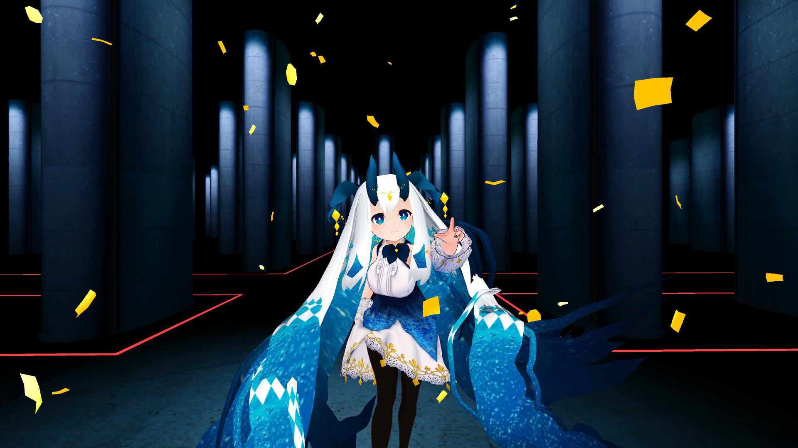
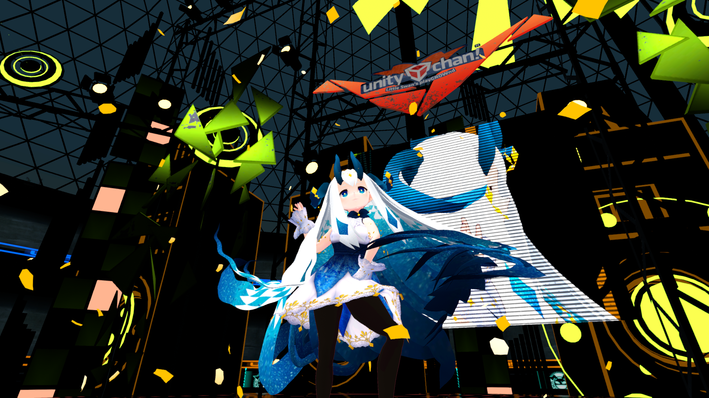

# Live-V
VRMファイルでライブを見よう！！

# Windows版

https://yahagi-day.booth.pm/items/1479177
# WebGL版

WebGL版は一部の演出が簡略化されています。リッチな演出を楽しみたい方はWindows版をお使い下さい。

www.magical-project.com

# 使い方
読み込みたいアバターを選択するかDefault Avaterを選択するとLiveが始まります。止まりません。
コードを使ってなんやかんやする人はステージデータがないことに気をつけてください。

# 使ったもの
- UniVRM (MIT) https://github.com/vrm-c/UniVRM
- UniRx (MIT) https://github.com/neuecc/UniRx
- VRMLoaderUI (MIT) https://github.com/m2wasabi/VRMLoaderUI
- UnityStandaloneFileBrowser (MIT) https://github.com/gkngkc/UnityStandaloneFileBrowser
- Unity-Chan "Candy Rock Star" (© UTJ/UCL) https://github.com/unity3d-jp/unitychan-crs
- 地下空間ステージ　(同梱されていません。製作者の方に特別に許可をいただき使用しています) http://seiga.nicovideo.jp/seiga/im6521973
- VirtualMotionCaputure (MIT) https://github.com/sh-akira/VirtualMotionCapture
- シヴィ (本来は再配布禁止ですが製作者の方に特別に許可をいただき、リポジトリ内に同梱しています) https://hub.vroid.com/characters/2921449382296017140/models/2134194530220818852

この作品は『[ユニティちゃんライセンス条項](http://unity-chan.com/contents/license_jp/)』の元に提供されています
